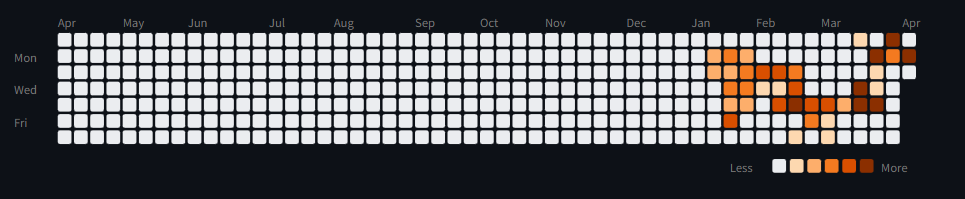

# claudeGrass

Claude Code의 토큰 사용량을 GitHub 잔디(히트맵) SVG로 시각화하고, 자동으로 GitHub에 push하는 Python CLI 도구입니다.

## 미리보기

GitHub 레포지토리에 아래와 같은 히트맵이 자동으로 생성됩니다:



## 요구사항

| 항목 | 조건 |
|---|---|
| OS | **Windows 전용** (작업 스케줄러 `schtasks` 사용) |
| Python | >= 3.9 |
| Claude Code | 설치 및 사용 이력 필요 (`~/.claude/projects/` 에 JSONL 데이터가 있어야 함) |
| GitHub | Personal Access Token (PAT) 필요, **repo** 스코프 권한 |
| 네트워크 | GitHub API 접근 가능해야 함 |

## 설치

### PyPI에서 설치 (권장)

```bash
pip install claudegrass
```

### 소스에서 설치

```bash
git clone https://github.com/welikeWatermelon/claudeGrass.git
cd claudeGrass
pip install -e .
```

> **참고**: `claudegrass` 명령어가 인식되지 않는 경우, `python -m claudegrass` 로 대체할 수 있습니다.

## 사용법

### 1. 초기 설정

```bash
python -m claudegrass setup
```

아래 4가지를 순서대로 입력합니다:

```
=== claudeGrass 초기 설정 ===

GitHub Personal Access Token (PAT): ← ghp_xxxx 붙여넣기 (입력 시 화면에 표시되지 않음)
GitHub 레포지토리 (owner/repo): ← 예: username/claude-usage
자동 실행 시간 (0-23, 기본값 18): ← Enter 시 18시, 원하는 시간 입력 가능

잔디 색상 테마를 선택하세요:
  1) green
  2) orange
  3) blue
  4) purple
  5) pink
테마 번호 (1-5, 기본값 2/orange): ← 원하는 테마 번호 입력
```

설정 완료 시:
- `~/.claudegrass/config.json` 에 설정이 저장됩니다
- Windows 작업 스케줄러에 매일 지정 시간에 자동 실행되도록 등록됩니다
- GitHub 레포에 README.md가 자동 생성됩니다

### 2. 수동 실행

```bash
python -m claudegrass run
```

실행하면 아래 과정이 자동으로 진행됩니다:

```
[1/3] 토큰 데이터 파싱 중...
  → 39일, 총 535,545,251 토큰
[2/3] SVG 히트맵 생성 중...
  → SVG 생성 완료 (41,386 bytes)
[3/3] GitHub push 중...
[ok] token-heatmap.svg push 완료

완료!
```

### 3. 자동 실행

setup에서 설정한 시간에 Windows 작업 스케줄러가 매일 자동으로 `claudegrass run`을 실행합니다.
수동으로 따로 실행할 필요 없이, 매일 GitHub 레포의 히트맵이 업데이트됩니다.

## GitHub PAT 발급 방법

1. GitHub → **Settings** → **Developer settings** → **Personal access tokens** → **Tokens (classic)**
2. **Generate new token (classic)** 클릭
3. Note: 아무 이름 (예: `claudegrass`)
4. Expiration: 원하는 만료 기간 선택
5. Scopes: **`repo`** 체크 (전체 저장소 접근 권한)
6. **Generate token** 클릭
7. 생성된 `ghp_xxxx...` 토큰을 복사 (이후 다시 볼 수 없음)

## 색상 테마

5가지 색상 테마를 지원합니다. setup 시 선택할 수 있습니다.

| 테마 | 0단계 (없음) | 1단계 | 2단계 | 3단계 | 4단계 | 5단계 |
|---|---|---|---|---|---|---|
| **green** |  `#ebedf0` |  `#c6e48b` |  `#7bc96f` |  `#239a3b` |  `#196127` |  `#0e3d16` |
| **orange** |  `#ebedf0` |  `#fdd8b0` |  `#fdae6b` |  `#f47a20` |  `#d94f00` |  `#8b2f00` |
| **blue** |  `#ebedf0` |  `#c0d6f9` |  `#73a8f0` |  `#3b7dd8` |  `#1b5eb5` |  `#0a3d7a` |
| **purple** |  `#ebedf0` |  `#d5c8f0` |  `#a88de0` |  `#7b4fcf` |  `#5a2da8` |  `#3b1278` |
| **pink** |  `#ebedf0` |  `#f9c0d6` |  `#f073a8` |  `#d83b7d` |  `#b51b5e` |  `#7a0a3d` |

## 색상 단계 기준

색상 단계는 **고정된 토큰 수가 아니라, 사용자의 실제 데이터를 기반으로 자동 계산**됩니다.

활동이 있는 날의 토큰 사용량을 정렬한 뒤, **백분위수(percentile)** 로 5단계를 나눕니다:

| 단계 | 기준 | 설명 |
|---|---|---|
| 0단계 | 0 토큰 | 해당 날짜에 Claude Code 사용 기록 없음 |
| 1단계 | 하위 ~20% | 가벼운 사용 |
| 2단계 | 하위 ~40% | 보통 사용 |
| 3단계 | 하위 ~60% | 활발한 사용 |
| 4단계 | 하위 ~80% | 매우 활발한 사용 |
| 5단계 | 상위 ~20% | 최고 사용량 |

### 예시 (실제 데이터 기준)

36일간의 사용 데이터가 있을 때:

| 단계 | 토큰 범위 |
|---|---|
| 0단계 | 0 (활동 없음) |
| 1단계 | 1 ~ 약 180만 |
| 2단계 | 약 180만 ~ 약 350만 |
| 3단계 | 약 350만 ~ 약 550만 |
| 4단계 | 약 550만 ~ 약 900만 |
| 5단계 | 약 900만 이상 |

> **참고**: 위 수치는 예시이며, 데이터가 쌓일수록 임계값이 자동으로 재조정됩니다. 사용량이 적은 초기에는 낮은 토큰으로도 높은 단계가 나올 수 있습니다.

## 토큰 집계 방식

`~/.claude/projects/` 하위의 모든 JSONL 파일을 순회하며, 각 항목에서 아래 4가지 토큰을 합산합니다:

| 토큰 종류 | 설명 |
|---|---|
| `input_tokens` | 사용자 입력에 사용된 토큰 |
| `output_tokens` | Claude 응답에 사용된 토큰 |
| `cache_creation_input_tokens` | 캐시 생성 시 사용된 토큰 |
| `cache_read_input_tokens` | 캐시 읽기 시 사용된 토큰 |

**날짜별 총 토큰** = `input_tokens` + `output_tokens` + `cache_creation_input_tokens` + `cache_read_input_tokens`

## 설정 파일

설정은 `~/.claudegrass/config.json` 에 저장됩니다:

```json
{
  "github_pat": "ghp_xxxx...",
  "repo": "username/claude-usage",
  "schedule_hour": 18,
  "theme": "orange"
}
```

설정을 변경하려면 `python -m claudegrass setup`을 다시 실행하면 됩니다.

## 프로젝트 구조

```
claudeGrass/
├── claudegrass/
│   ├── __init__.py      # 버전 정보
│   ├── cli.py           # CLI 진입점, 초기 설정 및 메인 실행
│   ├── parser.py        # JSONL 토큰 데이터 파싱
│   ├── generator.py     # GitHub 스타일 SVG 히트맵 생성
│   ├── github.py        # GitHub Contents API 연동
│   └── scheduler.py     # Windows 작업 스케줄러 등록
├── tests/               # 유닛 테스트
├── pyproject.toml       # 패키지 설정
└── setup.py
```

## 제한사항

- **Windows 전용**: 작업 스케줄러 자동 등록이 `schtasks` 명령어를 사용하므로 Windows에서만 동작합니다. macOS/Linux에서는 수동 실행(`python -m claudegrass run`)은 가능하지만, 자동 스케줄링은 지원하지 않습니다.
- **Claude Code 필수**: `~/.claude/projects/` 디렉토리에 JSONL 파일이 있어야 합니다. Claude Code를 사용한 적이 없으면 데이터가 없습니다.
- **PAT 만료**: GitHub PAT에 만료 기간이 설정되어 있으면, 만료 후 push가 실패합니다. 이 경우 새 PAT를 발급받고 `setup`을 다시 실행하세요.
- **외부 의존성**: `requests` 라이브러리만 사용합니다.

## 라이선스

MIT
